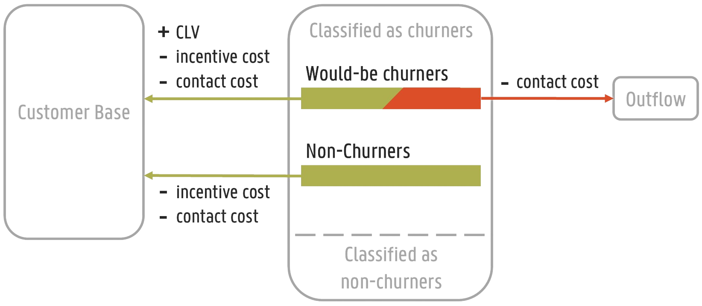

=========================
Choosing the right metric
=========================

Empulse provides a variety of metrics to evaluate the performance of a model.
Choosing the right metric is crucial to gauge the performance of your model in the real world.
Before choosing a metric, it is important to understand the problem you are trying to solve and the business context.
Value and cost-sensitive metrics are particularly useful
when the costs and benefits of different outcomes are not equal.
To quantify the consequences of different outcomes,
both streams of literature use a cost matrix (or cost-benefit matrix).

Cost Matrix
===========

The cost matrix is a square matrix where the rows represent the predicted class and the columns represent the true class.
Each element of the matrix represents the cost associated with the corresponding pair of predicted and true classes.

.. list-table::

    * -
      - Actual positive :math:`y_i = 1`
      - Actual negative :math:`y_i = 0`
    * - Predicted positive :math:`\hat{y}_i = 1`
      - :math:`C(1|1)`
      - :math:`C(1|0)`
    * - Predicted negative :math:`\hat{y}_i = 0`
      - :math:`C(0|1)`
      - :math:`C(0|0)`

All value-driven and cost-sensitive metrics are derived from the cost matrix.
Empulse represents these costs as ``tp_cost``, ``fp_cost``, ``fn_cost``, and ``tn_cost``,
for true positive, false positive, false negative, and true negative costs, respectively.

So if you want to indicate that making a false positive prediction is 5 times more costly than
making a false negative prediction, you can set the costs as follows:

.. code-block:: python

    tp_cost = 0
    fp_cost = 5
    fn_cost = 1
    tn_cost = 0

An important side note is that in value-driven metrics, the cost of correctly classifying is seen as a benefit.
Therefore, the cost matrix is often referred to as a cost-benefit matrix in this context.
Concretely, this just mean that a value-driven cost-benefit matrix
just takes the negative of the true positive and true negative costs.

.. list-table::

    * -
      - Actual positive :math:`y_i = 1`
      - Actual negative :math:`y_i = 0`
    * - Predicted positive :math:`\hat{y}_i = 1`
      - :math:`b_0 = -C(1|1)`
      - :math:`c_0 = C(1|0)`
    * - Predicted negative :math:`\hat{y}_i = 0`
      - :math:`c_1 = -C(0|1)`
      - :math:`b_1 = C(0|0)`

For value-driven metrics,
Empulse represents the cost and benefits as ``tp_benefit``, ``fp_cost``, ``fn_cost``, and ``tn_benefit``,
for true positive, false positive, false negative, and true negative benefits, respectively.

So if you want to indicate that making a true positive prediction is 5 times more beneficial than
making a true negative prediction, you can set the costs as follows:

.. code-block:: python

    tp_benefit = 5
    fp_cost = 0
    fn_cost = 0
    tn_benefit = 1

Example Cost-Benefit Matrix
===========================

The best way to understand the cost matrix is through an example.
Consider a binary classification problem
where the goal is to predict whether a customer is going to churn in the next year.

We presumes a situation where predicted churners are contacted and offered an incentive to remain customers.
Only a fraction of churners accepts the incentive offer (the accept rate).
If a churner accepts the incentive, the company wins back the customer and receives the customer's lifetime value.
If a loyal customer is offered an incentive, they will happily accept it, since they were going to stay anyway.
In both situations, the company incurs a cost for contacting the customer and the cost of the incentive.
If a churner declines the incentive, the company still incurs the cost of contacting the customer.

.. role:: raw-html(raw)
    :format: html

:raw-html:` `

The cost-benefit matrix for this example is shown in the figure above.

- accepts rate: :math:`\gamma`
- customer lifetime value: :math:`CLV`
- cost of contacting the customer: :math:`c`
- cost of the incentive: :math:`d`

.. list-table::

    * -
      - Actual positive :math:`y_i = 1`
      - Actual negative :math:`y_i = 0`
    * - Predicted positive :math:`\hat{y}_i = 1`
      - :math:`-C(1|1) = b_0 = \gamma \cdot (CLV - d - c) - (1 - \gamma) \cdot c`
      - :math:`C(1|0) = c_0 = -(d + c)`
    * - Predicted negative :math:`\hat{y}_i = 0`
      - :math:`C(0|1) = c_1 = 0`
      - :math:`-C(0|0) = b_1 = 0`

Empulse already has metrics implemented that can handle this cost-benefit matrix.
But you can easily implement your own cost-benefit matrix by passing the costs and benefits to the metrics and models.

Instance-dependent Costs
========================

So far all costs have been constant.
However, in many real-world applications, the cost of classification can vary between instances.
For instance, in the context of customer churn,
the cost of misclassifying a highly valuable churner is higher than the cost of misclassifying a less valuable churner.
To account for this, we can introduce instance-dependent costs.
We can say that we take the individual customer's lifetime value into account.
The instance-dependent cost matrix is shown below.

.. list-table::

    * -
      - Actual positive :math:`y_i = 1`
      - Actual negative :math:`y_i = 0`
    * - Predicted positive :math:`\hat{y}_i = 1`
      - :math:`-C_i(1|1) = b_{0,i} = \gamma \cdot (CLV_i - d - c) - (1 - \gamma) \cdot c`
      - :math:`C_i(1|0) = c_{0,i} = -(d + c)`
    * - Predicted negative :math:`\hat{y}_i = 0`
      - :math:`C_i(0|1) = c_{1,i} = 0`
      - :math:`-C_i(0|0) = b_{1,i} = 0`

In Empulse instance-dependent costs are represented as arrays.
These arrays are passed to the metrics and models as ``tp_cost``, ``fp_cost``, ``fn_cost``, and ``tn_cost``.
So note that if you pass a single value to these parameters, Empulse will interpret it as a class-dependent cost.

**class-dependent cost**:

.. code-block:: python

    tp_cost = 1
    fp_cost = 1
    fn_cost = 1
    tn_cost = 1

**instance-dependent cost**:

.. code-block:: python

    tp_cost = [1, 2, 3, 4, 5]
    fp_cost = [1, 2, 3, 4, 5]
    fn_cost = [1, 2, 3, 4, 5]
    tn_cost = [1, 2, 3, 4, 5]

Converting the cost-matrix to metrics
=====================================

As mentioned earlier, Empulse provides a variety of metrics to evaluate the performance of a model using the cost matrix.
The section below dive into the details of the metrics and how they can be used to evaluate the performance of a model.

For a brief summary of what each metric does and why it is useful, see the table below.

.. list-table::
    :header-rows: 1

    - * Metric
      * Description
    - * :func:`~empulse.metrics.cost_loss`
      * Measures how much a classifier would cost if it were to be used in the real world.
        It takes the instance-dependent costs into account.
    - * :func:`~empulse.metrics.expected_cost_loss`
      * Similar to the cost loss, but takes the predicted class probabilities into account.
        So it will punish classifiers if they are not confident in their predictions.
        It takes the instance-dependent costs into account.
    - * :func:`~empulse.metrics.expected_log_cost_loss`
      * Similar to the expected cost loss, but uses the logarithm of the predicted class probabilities.
        This will punish classifiers if they are not confident in their predictions and
        will punish them more if they are very confident in the wrong class.
        This can be seen as a generalization of the weighted cross-entropy loss.
        It takes the instance-dependent costs into account.
    - * :func:`~empulse.metrics.savings_score`
      * Measures how much a classifier saved over a baseline model (in terms of the cost loss).
        1 is the perfect model, 0 is as good as the baseline model, and negative values are worse than the baseline model.
        It takes the instance-dependent costs into account.
    - * :func:`~empulse.metrics.expected_savings_score`
      * Similar to the savings score, but takes the predicted class probabilities into account.
        So it will punish classifiers if they are not confident in their predictions.
        It takes the instance-dependent costs into account.
    - * :func:`~empulse.metrics.max_profit_score`
      * Measures how much profit a classifier would make if it were to be used at the optimal decision threshold.
        The optimal decision threshold maximizes the profit and is calculated by the metric.
        It does **NOT** take the instance-dependent costs into account, rather it evaluates global classifier performance.
    - * :func:`~empulse.metrics.emp_score`
      * Similar to the maximum profit score, but takes the expected value of the cost-benefit distribution.
        This allows you to express uncertainty over certain costs or benefits.
        Note that the "expected" does not refer to the class probabilities,
        but to the expected value of the cost-benefit distribution.

(Expected) Cost Loss
--------------------

The cost loss measures what the cost of a classifier would be if it were to be used in the real world.
Therefore, you want to pick a classifier that minimizes the cost loss.

The cost loss of a classifier with parameters :math:`\theta`
is the sum of the costs associated with the predicted classes.
It is calculated as follows:

.. math::

    \text{Cost}(X, \theta) = \sum_{i=1}^{n} \text{C}_i(\hat{y}_i(X_i, \theta)|y_i)

where :math:`\hat{y}_i`, :math:`y_i`, :math:`X_i` are the predicted class, true class,
and feature vector of the :math:`i`-th instance, respectively.

The expected cost loss is the sum of the costs weighted with the predicted class probabilities.

.. math::

    \mathbb{E}(\text{Cost}(X, \theta)) = \sum_{i=1}^n \big[ \text{P}(y_i = 1 | X_i, \theta) \cdot \text{C}_i(1|y_i) + \text{P}(y_i = 0 | X_i, \theta) \cdot \text{C}_i(0|y_i) \big]

where :math:`\text{P}(y_i| X_i, \theta)` is the predicted class probability of the :math:`i`-th instance.

(Expected) Savings Score
------------------------

The cost savings of a classifiers is the cost the classifier saved over a baseline classification model.
By default, the baseline model is the naive model (predicting all ones or zeros whichever is better).
With 1 being the perfect model, 0 being not better than the baseline model.

.. math::

    \text{Savings}(X, \theta) = 1 - \frac{\text{Cost}(X, \theta)}{\text{Cost}(X,\theta^\prime)}

with :math:`\theta^\prime` being the parameters of the baseline model.
If the baseline model is the naive model, the cost savings can be calculated as follows:

.. math::
    \text{Cost}_{\text{naive}}(X) = \min\left(\sum_{i=1}^n \text{C}_i(0 | y_i), \sum_{i=1}^n \text{C}_i(1 | y_i)\right).

The expected savings of a classifier is the expected cost the classifier saved over a baseline classification model.

.. math::

    \mathbb{E}(\text{Savings}(X, \theta)) = 1 - \frac{\mathbb{E}(\text{Cost}(X, \theta))}{\mathbb{E}(\text{Cost}(X, \theta^\prime))}

Since the naive model only predicts 1s or 0s, the expected cost of the naive model is the same as the cost of the naive model.

.. math::

    \mathbb{E}(\text{Cost}_{\text{naive}}(X)) = \text{Cost}_{\text{naive}}(X)

(Expected) Maximum Profit Score
-------------------------------

The maximum profit score of a classifier measures how much profit a classifier would make
if it were to be used at the optimal decision threshold.
To maximize the profit, let's define the profit as follows:

.. math::

    \text{Profit}(t) = b_0 \pi_0 F_0(t) + b_1 \pi_1 (1 - F_1(t)) - c_0 \pi_0 (1 - F_0(t)) - c_1 F_1(t)

where :math:`F_0(t)` and :math:`F_1(t)` are the false positive and false negative rates at threshold :math:`t`,
and :math:`\pi_0` and :math:`\pi_1` are the prior probabilities of the classes.
Note that in value-driven literature, the positive class is denoted as 0 and the negative class as 1
(hence :math:`\pi_0` is the prior probability of the positive class).

The optimal decision threshold :math:`T` is the threshold that maximizes the profit.
The maximum profit score is the profit at the optimal decision threshold.

.. math::

    \text{MP} = \max_{\forall t} \text{Profit}(t) = \text{Profit}(T)

In the the maximum profit score, it is assumed that the costs and benefits are deterministic.
If you assume that the costs and benefits are stochastic, you can use the expected maximum profit score.

.. math::

    \mathbb{E}(\text{MP}) = \int_{b_0} \int_{c_0} \int_{b_1} \int_{c_1} \text{Profit}(T;b_0, c_0, b_1, c_1) \cdot w(b_0, c_0, b_1, c_1) \, db_0 dc_0 db_1 dc_1

where :math:`w(b_0, c_0, b_1, c_1)` is the join probability density function of the cost-benefit distribution.
In practice usually only one variable is presumed to be stochastic.